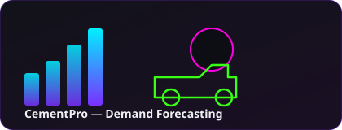
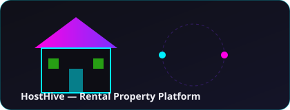
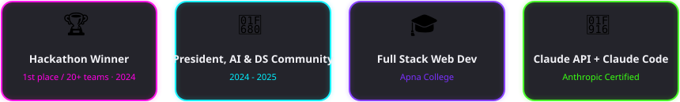

<div align="center">


<br/>

<a href="https://github.com/anshmahajan26/"></a>
<a href="https://www.linkedin.com/in/ansh-mahajan26052004b/"></a>
<a href="https://portfolio-pzy8.onrender.com"></a>
<a href="mailto:anshmahajan345@gmail.com"></a>

</div>

<br/>

<div align="center">

</div>

---

### 👋 About Me

- 🔭 Full-stack **MERN** developer building production-oriented web apps with secure **JWT auth** and **Razorpay** payment workflows
- 🤖 I connect **machine learning services** (XGBoost, FastAPI) into real-world systems — not just notebooks
- ⚡ Power-user of **GenAI tools** (ChatGPT, Claude, GitHub Copilot, Gemini API) — I use them to move fast, then I own the debugging, validation, and system design myself
- 🎓 B.E. in **Artificial Intelligence & Data Science**, G.S.M. College of Engineering, Pune (SPPU) — CGPA 8.77
- 🌱 Currently sharpening ML-pipeline + deployment skills through real projects like **CementPro**

---

### 🛠️ Tech Stack

<div align="center">


</div>

<div align="center">


</div>

**GenAI toolkit:**    

---

### 💼 Experience

```text
Apr 2025 – Oct 2025   React Developer Intern @ JP Technology
                      → Built responsive React + Tailwind UI, integrated REST APIs
                      → Debounced/throttled high-frequency events to cut re-renders & network calls
                      → Used Copilot/ChatGPT for boilerplate, manually refined for production

Dec 2024 – Jan 2025   Web Development Intern @ NewAI Lab
                      → Built an Expense Tracker app end-to-end
                      → Used ChatGPT to draft edge-case tests, manually caught rounding/negative bugs
```

---

### 🚀 Featured Projects

<table>
<tr>
<td width="50%" valign="top">



**🏗️ CementPro** — *Material Procurement & Sustainability Platform*

Predicts next-day ready-mix concrete demand (XGBoost + Random Forest + weather data) to kill over/under-ordering. Ships a procurement engine, Gemini-powered NL querying, JWT role-based access (Admin/Manager/Operator), and automated Excel/PDF reporting.

`React` `Node.js` `FastAPI` `XGBoost` `MongoDB` `Gemini API`

</td>
<td width="50%" valign="top">



**🏠 HostHive** — *Rental Property Management Platform*

Full CRUD platform for property listings & reservations. Copilot-accelerated route generation, hand-built validation, error handling, and duplicate-booking checks on top.

`React` `Node.js` `MongoDB`

</td>
</tr>
</table>

---

### 🏆 Achievements

<div align="center">

</div>

**Certifications:** Full Stack Web Development (Apna College) · SQL Certified (HackerRank) · JavaScript Intermediate (HackerRank) · Building with the Claude API (Anthropic) · Claude Code in Action (Anthropic)

---

### 🎓 Education

| Qualification | Institution | Result | Years |
|---|---|---|---|
| B.E. — Artificial Intelligence & Data Science | G.S.M. College of Engineering, Pune (SPPU) | CGPA 8.77 | 2022 – 26 |
| Higher Secondary Certificate (Class 12) | Nutan Vidyalaya Malkapur | 89.83% | 2021 – 22 |
| Secondary School Certificate (Class 10) | D.E.S Highschool Datala | 96.40% | 2019 – 20 |

---


### 🐍 Contribution Snake

Generated automatically by the GitHub Action in `.github/workflows/snake.yml` — it eats your real contribution graph every day.

<div align="center">

</div>

> This image appears once the workflow below has run at least once.

---

<div align="center">

### 📫 Let's Connect

**anshmahajan345@gmail.com** &nbsp;·&nbsp; +91&nbsp;9975363927


</div>

<!--
SETUP CHECKLIST (delete this comment once done)
1. Create a repo named EXACTLY "anshmahajan26" (same as your GitHub username) — that's what turns a README into your profile page.
2. Push this whole folder (README.md, assets/, .github/) to that repo's main branch.
3. Go to Settings → Actions → General → Workflow permissions → set to "Read and write permissions" (required for the snake workflow to push to the `output` branch).
4. Run the "Generate Snake Animation" workflow once manually from the Actions tab (or just push — it also runs on push to main).
5. Everything else (stats cards, streak, typing SVG, top languages, view counter, rain, achievements) works immediately, no extra setup — they're either static SVGs in /assets or public read-only services keyed to your username.
-->
